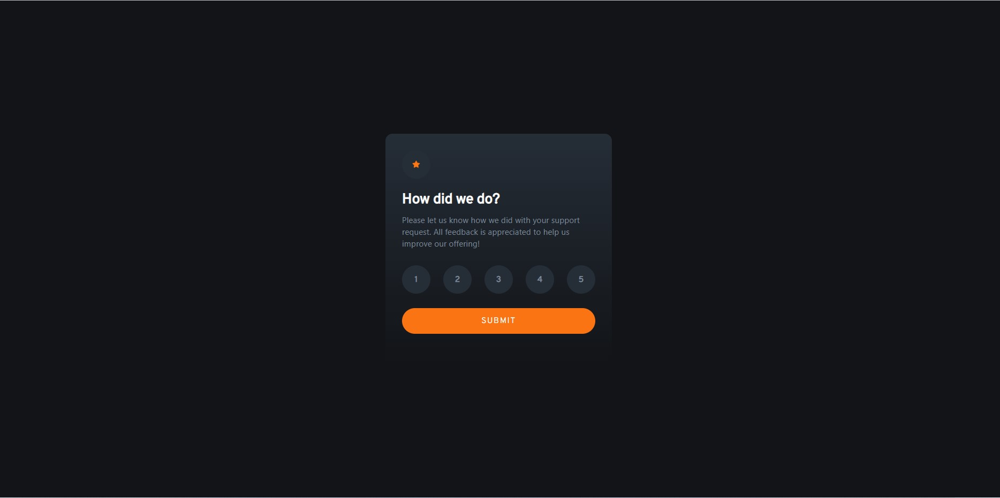

# Frontend Mentor - QR code component solution

This is a solution to the [Interactive rating component challenge on Frontend Mentor](https://www.frontendmentor.io/challenges/interactive-rating-component-koxpeBUmI). Frontend Mentor challenges help you improve your coding skills by building realistic projects. 

## Table of contents

- [Overview](#overview)
  - [Screenshot](#screenshot)
  - [Links](#links)
- [My process](#my-process)
  - [Built with](#built-with)
- [Author](#author)

**Note: Delete this note and update the table of contents based on what sections you keep.**

## Overview

### Screenshot

### Links

- Solution URL: https://github.com/CozminDev/angular-tailwind-rating
- Live Site URL: https://cozmindev.github.io/angular-tailwind-rating/

## My process

### Built with

- [Angular](https://angular.io/) - JS framework
- [Tailwind](https://tailwindcss.com/) - CSS framework

## Author

- Frontend Mentor - https://www.frontendmentor.io/profile/CozminDev